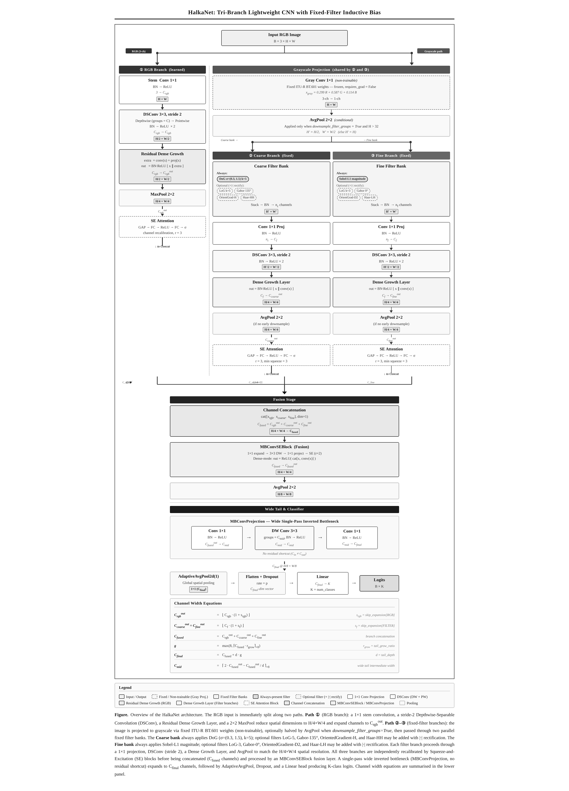

# HalkaNet: A Tri-Branch Lightweight CNN with Fixed-Filter Inductive Bias for Accurate Edge-Device Image Classification

<p align="center">
  
</p>

<p align="center">
  
  
  
  
  
</p>

> **"Halka"** (हल्का / ہلکا) means *lightweight* in Hindi/Urdu — reflecting the core design goal of this architecture.

---

## Overview

**HalkaNet** is a single, unified lightweight CNN architecture designed to operate accurately across the full spectrum of constrained compute — from **bare-metal microcontrollers (MCUs)** to **edge SoCs and desktop CPUs** without any pretrained weights.

Its core novelty is that the same architecture, through simple hyperparameter tweaks (`filter_channels`, `tail_depth`, `skip_expansion`, `filters`), can be configured to fit within a 46K MCU deployment budget or a 400K edge deployment budget. There is no separate MCU variant and edge variant, **one architecture, one codebase, both targets**. This is what makes HalkaNet unique among lightweight CNN designs.

The mechanism behind this flexibility: instead of using all parameters to learn low-level features (edges, blobs, textures) from scratch, HalkaNet **hard-wires these as fixed, non-trainable filter banks**, freeing every learnable parameter for high-level discrimination. This inductive bias gives the model a strong starting representation from epoch 0, enabling competitive accuracy even at sub-50K parameter budgets.

---

## Architecture

<p align="center">
  
</p>

HalkaNet processes input through **three parallel branches** that are fused via independent per-branch SE attention and a wide inverted-bottleneck tail.

The RGB input is immediately split into two paths:
- **Path ①** — a fully learned RGB branch (1×1 stem, stride-2 DSConv, Residual Dense Growth Layer, MaxPool)
- **Path ②–③** — a fixed grayscale projection (frozen ITU-R BT.601 weights), optionally downsampled for MCU targets, then split into a **Coarse filter branch** (DoG always-present, LoG/Gabor/LBP/Haar optional) and a **Fine filter branch** (Sobel always-present, LoG/Gabor/LBP/Haar optional)

All three branches are independently recalibrated by SE attention blocks (BranchSE), concatenated, fused by an MBConvSEBlock, and passed through a single-pass wide tail (MBConvProjection) before the linear classifier.

### Core Building Blocks

| Component | Role | Inspiration |
|---|---|---|
| `DepthwiseSeparableConv` | DW 3×3 + PW 1×1, BN·ReLU ×2 | MobileNetV1 |
| `DenseGrowthLayer` | `out = BN·ReLU( cat[x, conv(x)] )` | DenseNet |
| `ResidualDenseGrowthLayer` | `extra = conv(x) + proj(x)` → dense concat | RDB / ESRGAN |
| `MBConvSEBlock` | MBConv + SE, concat-mode when out > in | EfficientNet |
| `MBConvProjection` | Wide single-pass inverted bottleneck, no residual | — |
| `BranchSE` | Independent SE per branch before fusion | SENet |

### Fixed Filter Banks

| Filter | Branch | Always Present | Description |
|---|---|---|---|
| `DoGFilter(σ=(0.3,1.5), k=5)` | Coarse | Yes | Signed blob / band structure |
| `SobelGradMagnitude(L1)` | Fine | Yes | Edge gradient magnitude |
| `LoGFilter(k=5)` | Coarse | Optional | Broad edge / blob detection |
| `LoGFilter(k=3)` | Fine | Optional | Fine edge detail |
| `GaborFilter(135°)` | Coarse | Optional | Diagonal texture |
| `GaborFilter(0°, k=3)` | Fine | Optional | Horizontal texture |
| `OrientedGradientFilter(H)` | Coarse | Optional | Horizontal gradient direction |
| `OrientedGradientFilter(D2)` | Fine | Optional | NW-SE diagonal gradient |
| `HaarWaveletFilter(HH)` | Coarse | Optional | Diagonal Haar subband |
| `HaarWaveletFilter(LH)` | Fine | Optional | Horizontal-edge Haar subband |

> Optional filters are activated via `filters=[FilterType.LOG, FilterType.GABOR, ...]`. All optional outputs pass through `|·|` (abs) rectification before stacking, followed by BatchNorm.

---

## Installation

```bash
# Clone
git clone https://github.com/md-zohaib-official/HalkaNetv1.git
cd HalkaNetv1

# Virtual environment (recommended)
python -m venv .venv
source .venv/bin/activate        # Linux / macOS
.venv\Scripts\activate           # Windows

# Install dependencies
pip install -r requirements.txt
```

**Core dependencies:** Python >= 3.9, PyTorch >= 2.0, torchvision, torchinfo

---

## Quick Start

### Ultra-light config — MCU target (~46K params)

```python
import torch
from halkanet import HalkaNet
from config import BranchType, FilterType

model = HalkaNet(
    num_classes=10,
    skip_expansion={BranchType.RGB: 1.0, BranchType.FILTER: 1.0},
    filter_channels=12,
    filters=[FilterType.LOG, FilterType.LBP],
    tail_depth=1,
)
# ~46K params | CIFAR-10: 87%+ Top-1 | fits STM32, ESP32-S3 targets

x = torch.randn(1, 3, 32, 32)
logits = model(x)          # (1, 10)
```

### Standard config — Edge / CPU target (~88K params)

```python
model = HalkaNet(
    num_classes=6,
    skip_expansion={BranchType.RGB: 1.5, BranchType.FILTER: 1.0},
    filter_channels=18,
    filters=[FilterType.LOG, FilterType.LBP, FilterType.WAVE],
    tail_depth=1,
)
# ~88K params | Intel Image: 91.83% Top-1 | 6.93 ms on i5-10300H
```

### Larger config — High-accuracy edge target (~392K params)

```python
model = HalkaNet(
    num_classes=6,
    skip_expansion={BranchType.RGB: 1.5, BranchType.FILTER: 1.5},
    rgb_stem_channels=16,
    filter_channels=20,
    filters=[FilterType.LOG, FilterType.LBP, FilterType.WAVE, FilterType.GABOR],
    tail_depth=2,
)
# ~392K params | Intel Image 150x150: 91.93% Top-1
```

---

## Benchmark Results

All models trained **from scratch** under identical conditions — same optimizer, scheduler, augmentation, and epoch count. No pretrained weights used anywhere.

> CPU Benchmark device: Intel Core i5-10300H @ 2.50GHz (4 physical / 8 logical cores), batch=1, n=500 runs.

---

### MCU / Ultra-Light Target — CIFAR-10 (32×32, 10 classes)

| Model | Top-1 | Params | MACs (M) | Size (MB) |
|---|---|---|---|---|
| **HalkaNet (~46K)** | **87%+** | **~46,000** | **< 5** | **< 0.20** |

> This configuration fits within the flash/RAM budget of STM32H7 and ESP32-S3 class devices. Deployable via Edge Impulse, TFLite, or ONNX export.

---

### Edge / CPU Target — Intel Image Classification (96×96, 6 classes, 100 epochs)

| Model | Top-1 | Top-5 | Params | MACs (M) | Size (MB) | Latency (ms) | FPS |
|---|---|---|---|---|---|---|---|
| **HalkaNet** | **91.83%** | **99.73%** | **88,354** | **46.9** | **0.30** | **6.93 ± 0.61** | **144.2** |
| ShuffleNetV2-0.5x | 87.67% | 98.93% | 347,942 | 7.3 | 1.39 | 6.15 | 162.5 |
| MobileNetV2-0.35x | 87.83% | 99.60% | 403,814 | 10.7 | 1.62 | 6.50 | 153.9 |
| SqueezeNet-1.1 | 88.70% | 99.77% | 725,574 | 43.2 | 2.90 | 3.01 | 331.7 |
| MobileNetV3-Small | 88.67% | 99.33% | 1,524,006 | 11.1 | 6.10 | 4.92 | 203.3 |

> HalkaNet achieves **+3.13–4.16 pp higher Top-1** than all baselines while using **4x–17x fewer parameters**.

---

### Challenging Benchmark — STL-10 (96×96, 10 classes, 5,000 train / 8,000 test, 100 epochs)

STL-10 is a particularly demanding benchmark: only 500 training images per class with a large test set, making it a strong test of generalisation from limited data.

| Model | Top-1 | Top-5 | Params | MACs (M) | Size (MB) | Latency (ms) | FPS |
|---|---|---|---|---|---|---|---|
| **HalkaNet** | **TBD** | **TBD** | **88,354** | **46.9** | **0.30** | **6.93 ± 0.61** | **144.2** |
| ShuffleNetV2-0.5x | — | — | 347,942 | 7.3 | 1.39 | 6.15 | 162.5 |
| MobileNetV2-0.35x | — | — | 403,814 | 10.7 | 1.62 | 6.50 | 153.9 |
| MobileNetV3-Small | — | — | 1,524,006 | 11.1 | 6.10 | 4.92 | 203.3 |

> STL-10 results will be updated in the accompanying research paper. The fixed-filter inductive bias is expected to be particularly advantageous here given the extremely limited training data per class.

---

### Filter Inductive Bias — Accuracy Saturation Study (Intel Image, 96×96)

Scaling parameters 4.4x (88K to 392K) yields only **+0.10 pp** accuracy gain — confirming that HalkaNet accuracy is **filter-bound, not parameter-bound**. Better filter combinations improve accuracy more than adding parameters.

| Config | Params | MACs (M) | Top-1 | Top-5 | Latency (ms) |
|---|---|---|---|---|---|
| HalkaNet — 3 filter types (LOG, LBP, WAVE) | 88,354 | 46.9 | 91.83% | 99.73% | 6.93 ± 0.61 |
| HalkaNet — 4 filter types (LOG, LBP, WAVE, GABOR) | 392,473 | 98.6 | 91.93% | 99.87% | 8.18 ± 1.96 |

---

## MCU Deployment

HalkaNet is validated on real MCU hardware via Edge Impulse. The `downsample_filter_groups=True` flag halves the spatial resolution of the fixed filter banks before processing, reducing MACs significantly for devices with tight memory constraints.

Tested deployment targets include:

| Device Class | Example | Notes |
|---|---|---|
| ARM Cortex-M7 | STM32H743 | INT8 quantised, TFLite Micro |
| ARM Cortex-M4 | STM32F411 | Smallest config only |
| Xtensa LX7 | ESP32-S3 | Full inference via TFLite |
| ARM Cortex-A | Raspberry Pi 4 | Full-precision, 144+ FPS |

> Full MCU latency and flash/RAM usage tables are provided in the accompanying research paper.

---

## Filter Design Philosophy

HalkaNet uses **heterogeneous filter grouping** — each branch mixes filters from orthogonal functional classes rather than grouping similar filters together.

- **Homogeneous groups** (e.g., multiple Gabor orientations in one branch) produce responses within the same feature subspace — high inter-filter correlation, low representational rank.
- **Heterogeneous groups** (e.g., DoG + LBP + Haar together) produce complementary, near-orthogonal projections — maximising the rank of the joint response matrix and improving class-conditional separability.

Different filter types are mathematically derived from different bases (Gaussian derivatives, wavelets, Fourier sinusoids, finite differences), meaning their joint response matrix has near-full rank by construction — achieving the representational diversity that learned CNNs spend parameters trying to discover.

---

## Channel Width Equations

```
C_rgb_out    = floor( C_rgb x (1 + s_rgb) )
C_coarse_out = floor( C_f   x (1 + s_f)   )      (= C_fine_out)

C_fused      = C_rgb_out + C_coarse_out + C_fine_out
g            = max(8, round8( C_fused x r_grow ))
C_final      = C_fused + tail_depth x g
C_mid        = round8( 2 x C_fused_out - C_fused_out / tail_depth )
```

`s_rgb`, `s_f` = skip_expansion ratios &nbsp;|&nbsp; `r_grow` = tail_grow_ratio &nbsp;|&nbsp; `round8` = nearest multiple of 8

---

## Project Structure

```
HalkaNetv1/
├── halkanet/
│   ├── __init__.py
│   ├── architectures.py     # HalkaNet model definition
│   ├── components.py        # DSConv, DenseGrowth, SE, MBConv blocks
│   └── filters.py           # Fixed filter bank implementations
├── config.py                # Enums, default hyperparameters
├── train.py                 # Training script
├── evaluate.py              # Evaluation & benchmark utilities
├── assets/
│   └── halkanet_architecture.png
├── requirements.txt
└── README.md
```

---

## Citation

If you use HalkaNet in your research or build upon it, please cite:

```bibtex
@misc{zohaib2025halkanet,
  title  = {HalkaNet: A Tri-Branch Lightweight CNN with Fixed-Filter
            Inductive Bias for Accurate Edge-Device Image Classification},
  author = {Md Zohaib},
  year   = {2025},
  url    = {https://github.com/md-zohaib-official/HalkaNetv1}
}
```

---

## About

This project is the **M.Tech Final Semester Research Project** of **Md Zohaib**,
Department of Computer Science and Engineering,
**SRM Institute of Science and Technology (SRMIST)**,
Kattankulathur, Chennai — 603203, Tamil Nadu, India.

---

<p align="center">
  Made with dedication at <b>SRM Institute of Science and Technology</b>, Chennai<br/>
  <i>M.Tech Final Semester Project — 2025</i>
</p>
